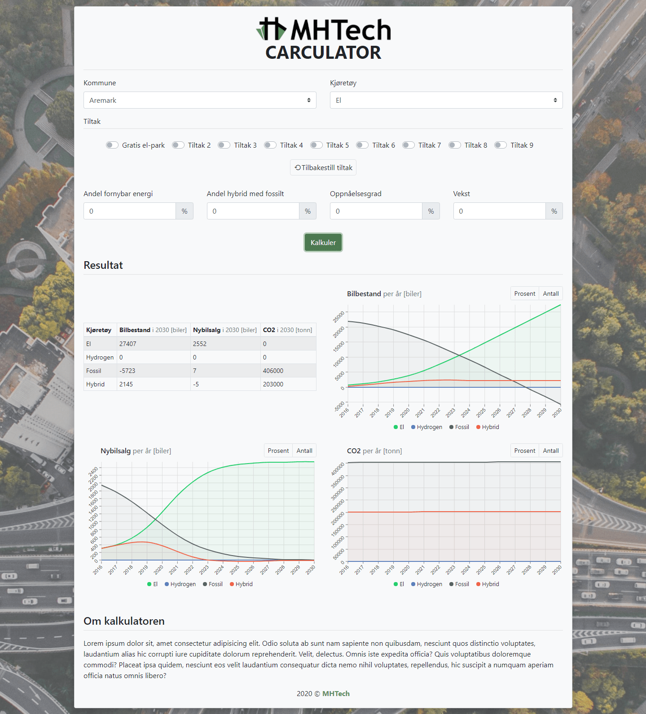

# MHTech's Carculator (Front-end)<!-- omit in toc -->

A calculator for municipalities to estimate environmental consequences of policies regarding vehicles.



## 📑 Table of Contents <!-- omit in toc -->

- [🎓 Prerequisites](#-prerequisites)
- [🚀 Quick start](#-quick-start)
- [➕ Recommended VSCode-extensions](#-recommended-vscode-extensions)
- [🧪 Cross platform and user testing](#-cross-platform-and-user-testing)
  - [Local manual testing](#local-manual-testing)
  - [Deployment and remote testing](#deployment-and-remote-testing)

## 🎓 Prerequisites

- Terminal ([Windows](https://www.youtube.com/watch?v=jbvqCqb-HJk), [Linux](https://www.suse.com/c/working-command-line-basic-linux-commands/), [Mac](https://www.youtube.com/watch?v=5XgBd6rjuDQ))
- [Node](https://nodejs.org/en/download/)
- [HTML and CSS](https://www.youtube.com/watch?v=vQWlgd7hV4A)
- [Sass](https://www.youtube.com/watch?v=Zz6eOVaaelI)
- [Javascript](https://www.youtube.com/playlist?list=PLDyQo7g0_nsX8_gZAB8KD1lL4j4halQBJ)
- [React](https://www.youtube.com/watch?v=dGcsHMXbSOA)

## 🚀 Quick start

1. Install [VSCode](https://code.visualstudio.com/)
1. Install [Node](https://nodejs.org/en/download/)
1. Install [Git](https://git-scm.com/)
1. [Create a GitHub user](https://github.com/join)
1. Get access to the [repository](https://github.com/MHTECHSoftware/frontEndSkvirr) (will show 404 error if you do not have permission)
1. Open VSCode
1. Clone the repository

   1. Open the command palette (Windows shortcuts are <kbd>F1</kbd> or <kbd>CTRL</kbd> + <kbd>SHIFT</kbd> + <kbd>P</kbd>)
   1. Enter

      ```console
      Git: Clone
      ```

   1. Paste

      ```console
      https://github.com/MHTECHSoftware/frontEndSkvirr
      ```

   1. Select a place to store the project
   1. Follow instructions
   1. Press "yes" to open repository, or open manually

1. Open the [integrated terminal in VSCode](https://code.visualstudio.com/docs/editor/integrated-terminal)

   - Tip: The norwegian keyboard shortcut is <kbd>CTRL</kbd> + <kbd>Ø</kbd>

1. Install all node packages:

   ```console
   npm install
   ```

   Remember to follow instructions to fix vulnerabilities (if any) before deployment in production.

1. Start the frontend

   ```console
   npm start
   ```

1. To commit, push and pull you'll need to [enter your username and email for git](https://git-scm.com/book/en/v2/Getting-Started-First-Time-Git-Setup). Check out this [guide](https://code.visualstudio.com/docs/editor/github) to learn more about how GitHub is used in VSCode.

You should now be ready for development and local testing. If not, contact your senior(s) or any of the contributors. Open your browser and go to http://localhost:3000/ or http://x.x.x.x:3000/ (where x.x.x.x is your local IP address).

## ➕ Recommended VSCode-extensions

- ESLint
- ES7 React/Redux/GraphQL/React-Native snippets
- Bracket Pair Colorizer
- Material Theme
- Material Icon Theme
- Live Server
- Prettier
- Markdown All in One
- GitLens

## 🧪 Cross platform and user testing

### Local manual testing

Make sure you have the [Live Server extension](https://marketplace.visualstudio.com/items?itemName=ritwickdey.LiveServer) installed, which enables devices on the same network to connect to the app.

_Warning: This may not work on public networks (e.g. school and work)!_

1. Open a browser on a device to connect and enter the following address (make sure it's connected to the same network as the host):

   ```console
   http://HOST.IP.ADDRESS:PORT/
   ```

   For example:

   ```console
   http://192.168.0.36:3000/
   ```

### Deployment and remote testing

As of 15.09.2020, this is not implemented. No preference? Use [Vercel](https://vercel.com/).
